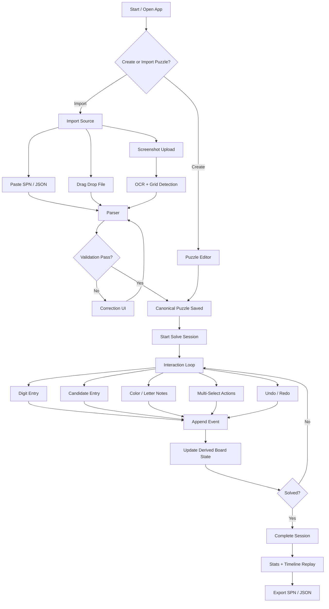
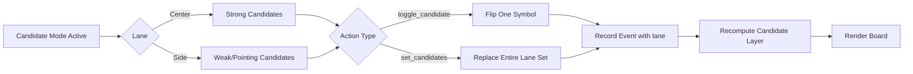
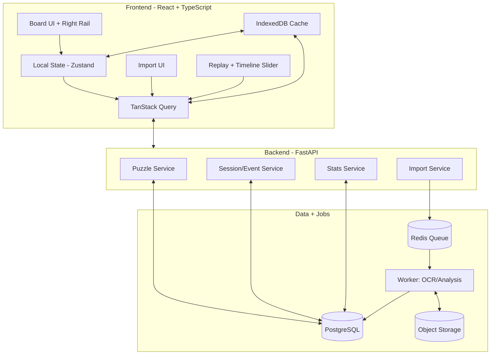
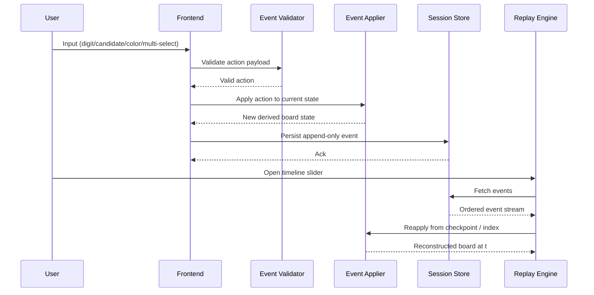
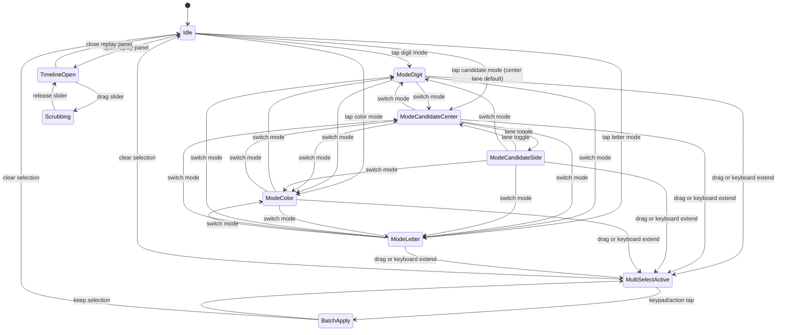

# ZenNine UX Flow and Architecture Diagrams

This document provides visual flows for core user journeys and a reference architecture for implementation.

## 1) End-to-End UX Flow (Import to Analysis)

## 2) Candidate Interaction Flow (Snyder-Oriented)

## 3) Runtime Architecture (Web App)

## 4) Event Pipeline and Replay Determinism

## 5) Suggested Implementation Order

1. Build end-to-end happy path: import SPN -> solve -> event append -> replay to end.
2. Add screenshot import and correction UI.
3. Add segmented stats and timeline breakpoint markers.
4. Add advanced drills and coaching features.

## 6) Right-Rail UI State Machine

